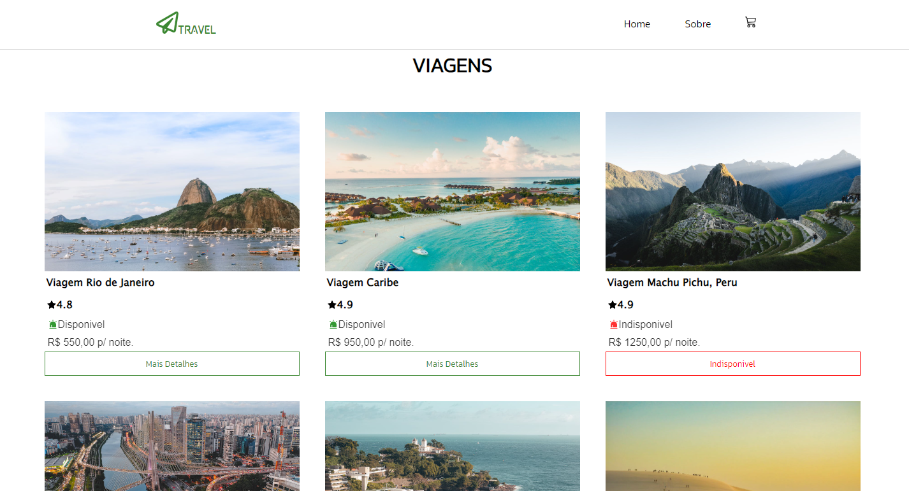

<h1 align="center": center">Travel</h1>
<h2>Home:</h2>

<h2>Details:</h2>

<h2>Cart:</h2>

<h2>💡The idea of creating was:</h2>
<ul>
  <li>Presenting my knowledge.</li>
  <li>Helping those in need of assistance.</li>
</ul>
<h2>⚙️Used Technologies:</h2>
<ul>
  <li>Node.Js</li>
  <li>TypeScript</li>
  <li>React.JS</li>
  <li>PostgreSQL</li>
</ul>
<h2>Methods Useds:</h2>
<ul>
  <li>Hooks</li>
  <li>Axios(API)</li>
  <li>Redux</li>
</ul>
